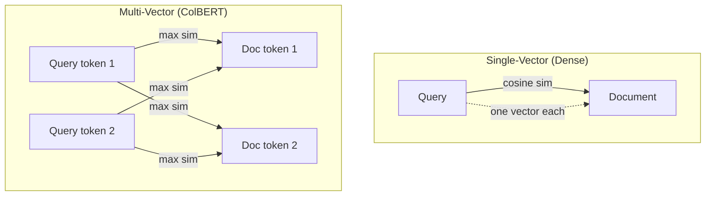

# State of the Art in Embedding Models (2026)

## MTEB Leaderboard Rankings (March 2026)

The Massive Text Embedding Benchmark (MTEB) is the standard evaluation suite for embedding models. It expanded from 56 to 100+ tasks in 2025, making cross-era comparisons difficult.

| Rank | Model | MTEB Score | Params | Dims | Max Tokens | Open? | Key Innovation |
|------|-------|-----------|--------|------|------------|-------|----------------|
| 1 | Gemini Embedding 001 | 68.32 | ? | 3072 (flex) | 8192 | No | MRL, proprietary distillation |
| 2 | NV-Embed-v2 | 72.31* | 7B | 4096 | 32768 | Yes (CC-BY-NC) | Latent attention pooling |
| 3 | Qwen3-Embedding-8B | 70.58 | 8B | 4096 (flex) | 32768 | Yes (Apache 2.0) | 150M synthetic pairs, SLERP merging |
| 4 | BGE-en-ICL | 71.24* | 7B | 4096 | 32768 | Yes | In-context learning for embeddings |
| 5 | Llama-Embed-Nemotron-8B | Top multi | 8B | 4096 | 32768 | Yes | Full open recipe + SDG pipeline |
| 6 | GTE-Qwen2-7B-instruct | 70.24* | 7B | 3584 | 32768 | Yes | Instruction-aware GTE |
| 7 | Voyage-3-large | ~67+ | ? | 2048 (flex) | 32768 | No | MRL + quantization-aware |
| 8 | Cohere Embed v4 | 65.2 | ? | 1024 (flex) | 128000 | No | Multimodal, 128K context |
| 9 | SFR-Embedding-Mistral | 67.6* | 7B | 4096 | 4096 | Yes | Multi-task training |
| 10 | Jina Embeddings v4 | ~65+ | 3B | 2048 | 8192 | Partial | Multimodal, task adapters |
| 11 | text-embedding-3-large | 64.6 | ? | 3072 (flex) | 8191 | No | MRL, widely adopted |
| 12 | BGE-M3 | 63.0 | 568M | 1024 | 8192 | Yes (MIT) | Dense+sparse+multi-vector |
| 13 | Nomic Embed Text V2 | ~62+ | 475M | 768 | 512 | Yes (Apache 2.0) | First MoE embedding model |
| 14 | EmbeddingGemma-300M | Competitive | 300M | 768 (flex) | 2048 | Yes | Distilled, on-device |

*\*Legacy 56-task scoring*

## Key Innovations by Model

### NV-Embed-v2 (NVIDIA, ICLR 2025)

The paper that defined the modern recipe for LLM-to-embedding conversion:

- **Latent attention pooling**: Instead of mean/CLS pooling, learn a set of query vectors that attend to the sequence output. Consistently outperforms all other pooling methods.
- **Bidirectional causal LLM**: Take Mistral-7B, remove the causal mask, use bidirectional attention. 2025 ICLR experiments confirmed this beats causal mask across all pooling types.
- **Two-stage instruction tuning**: Retrieval pre-training → task-specific fine-tuning
- **Hard-negative mining with positive relevance scoring**: A novel method that accounts for positive relevance to remove false negatives from training data.

### Qwen3-Embedding-8B (Alibaba)

- **Entirely synthetic training data**: 150M pairs generated by Qwen3-32B with controlled attributes (persona, difficulty, language)
- **Four data types**: retrieval, bitext mining, STS, classification
- **SLERP model merging**: Merge multiple fine-tuned checkpoints via Spherical Linear Interpolation for robustness
- **Apache 2.0 license**: Best open-weight option for commercial use

### BGE-M3 (BAAI)

The "Swiss Army knife" of embeddings:
- Single model doing **dense retrieval**, **sparse retrieval** (BM25-like), AND **multi-vector retrieval** (ColBERT-like)
- **Self-knowledge distillation**: Use relevance scores from all three modes as teacher signals for each other
- 100+ languages in one model
- Only 568M params — efficient and practical

### Nomic Embed Text V2

- **First MoE embedding model**: 8 experts, top-2 routing, only 305M of 475M params active per input
- Proves that Mixture of Experts works for embeddings, not just generative models
- Apache 2.0, fully open

### EmbeddingGemma (Google)

- **Decoder-to-encoder conversion** via T5Gemma architecture
- **Distillation from Gemini**: Large teacher → small student
- 300M params, runs on-device in <200MB RAM
- Proves small models can compete with careful distillation

## Multi-Vector Approaches (ColBERT Family)

Traditional embedding models produce **one vector per document**. Multi-vector models produce **one vector per token**, enabling fine-grained matching:

Key models:
- **Jina-ColBERT-v2**: Multilingual late interaction on XLM-RoBERTa
- **ColPali / ColQwen**: Late interaction for visual document retrieval
- **ECIR 2026**: First dedicated workshop on Late Interaction and Multi-Vector Retrieval

Advantage: Better out-of-domain generalization. Disadvantage: One vector per token means much higher storage.

## The Clear Trend

The embedding landscape has converged on a clear recipe:
1. Start with a large, well-pretrained decoder-only LLM (7-8B params)
2. Remove causal mask → bidirectional attention
3. Add latent attention pooling
4. Two-stage training: synthetic contrastive → domain fine-tuning with hard negatives
5. Matryoshka dimensions for flexibility
6. Instruction-aware: different task types get different instructions

Every top-5 model follows this pattern. The differentiator is now **training data quality** and **domain specialization** — exactly where a purpose-built Samyama model could compete.
