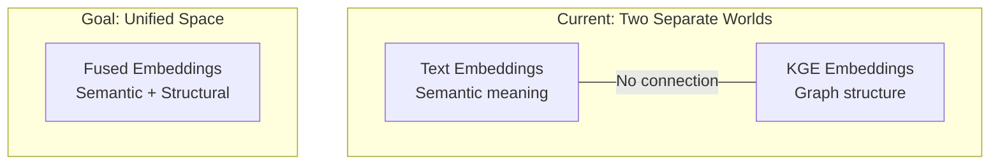

# Graph-Aware Embeddings

The intersection of embedding models and graph databases is largely unexplored territory. This chapter examines the current state, related research, and why Samyama Graph is uniquely positioned to advance this frontier.

## How Current Embedding Models Handle Graph-Structured Data

**They don't, really.** Current approaches are workarounds:

### Serialize to Text
Convert graph structures to natural language: `(Aspirin)-[TREATS]->(Headache)` becomes "Aspirin treats Headache". This loses:
- Directionality (treats vs. is treated by)
- Type information (TREATS is different from INTERACTS_WITH)
- Multi-hop context (what else does Aspirin treat? What else treats Headache?)

### Embed Nodes Independently
Embed each node's text properties separately. This completely loses relational structure — the embedding for "Aspirin" is the same whether it appears in a drug interaction graph or a chemistry textbook.

### Separate KGE Models
Knowledge Graph Embedding models (TransE, RotatE, ComplEx) operate in a **separate embedding space** from text embeddings. They capture graph structure beautifully but don't understand rich text semantics.

## Cypher Query Embeddings

This is an **open research problem with no existing solution**.

Current challenges:
- Text-to-Cypher is done via **LLM generation**, not embedding similarity
- Cypher has unique constructs with no natural language analogue:
  - Path patterns: `()-[*2..5]->()`
  - Variable binding: `MATCH (n:Drug)-[r:TREATS]->(d:Disease)`
  - Aggregation: `WITH n, count(r) as cnt`
  - Graph-specific functions: `shortestPath()`, `allShortestPaths()`

An embedding model that maps natural language questions AND Cypher queries into the **same semantic space** would enable:
- **Query-by-example**: "Find queries similar to this one"
- **Semantic Cypher search**: Match NL questions to existing Cypher patterns
- **Query recommendation**: Suggest relevant queries based on user intent
- **Hybrid text+Cypher retrieval**: Combined vector similarity with structural matching

## Related Research

### GraphFormers (2021-2023)
GNN layers nested inside transformer blocks. Iterative message passing + text encoding. Foundational but not production-ready for embedding generation.

### BioMedKG (2025) — Closest to What We Need
Multimodal contrastive learning that unifies:
1. **Language Model embeddings** for text modality
2. **Graph Contrastive Learning** for intra-entity relationships
3. **KGE models** (TransE/RotatE) for inter-entity relationships

Fuses all three into a unified embedding. This is the most relevant reference architecture.

### BioGraphFusion (2025)
CP decomposition for global semantic context + LSTM for structural learning. State-of-the-art for biomedical knowledge graph completion.

### GEDUM (2026)
Local-to-Global Feature Aggregation for dynamic KG updates. Uses GNN to learn global graph embeddings that update efficiently.

### Text Embeddings in Labeled Property Graphs (2025)
A direct study of using Qwen3-Embedding in property graphs. Achieved 0.93-0.99 F1 on node classification — but only using text properties, **not graph structure**.

## What's Missing: The Unified Vision

No existing system combines:
1. Rich text understanding (from LLM pretraining)
2. Graph structural encoding (from GNN/KGE)
3. Query language semantics (Cypher/SPARQL)
4. Domain specialization (biomedical, industrial, etc.)
5. HNSW-optimized output (for efficient vector search)

This is exactly the gap that a Samyama-native embedding model would fill.

## Current Graph DB + Vector Search Landscape

| System | Vector Search | Native Embeddings? | Graph + Vector Combined? |
|--------|--------------|--------------------|-----------------------|
| **Neo4j** | HNSW index on node properties | No — external APIs | Cypher + vector index queries |
| **TigerGraph** | TigerVector (2025) | No | Graph + vector for RAG |
| **Memgraph** | External via plugins | No | HybridRAG advocacy |
| **Samyama Graph** | HNSW (built-in) | **Proposed** | **Native integration proposed** |

The opportunity: Samyama could be the **first graph database with native embedding generation** that understands both text content and graph structure.
