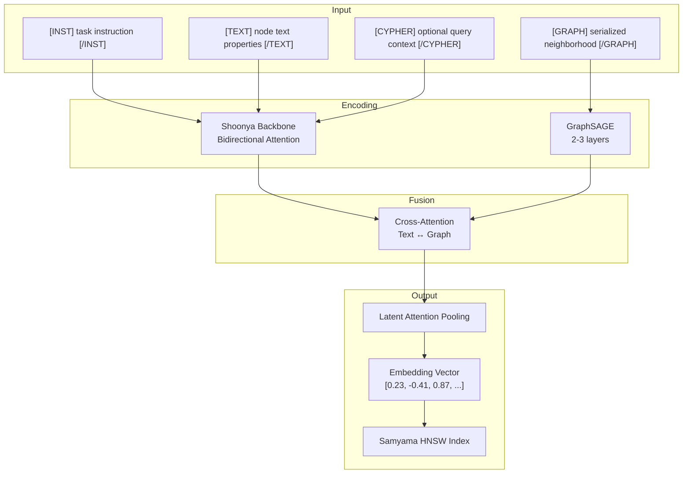

# Building a Samyama Embedding Model

This chapter proposes a concrete architecture for a graph-aware embedding model that combines Shoonya's language understanding with Samyama Graph's structural knowledge.

## Design Principles

1. **Graph-native**: Embeddings must encode graph topology, not just text
2. **Domain-specialized**: Optimized for biomedical, clinical trials, cricket, and industrial domains
3. **Cypher-aware**: Understand query language semantics
4. **HNSW-optimized**: Output vectors designed for Samyama's built-in vector index
5. **Flexible dimensionality**: Matryoshka training for 128-4096 dims

## Proposed Architecture



### Backbone: Shoonya (Bidirectional)

Take the Shoonya transformer and convert to bidirectional:
- Remove the causal attention mask
- Keep all pretrained weights (FlashAttention, MoE, Mamba blocks)
- The model retains its knowledge while gaining full-context embedding capability

### Graph Encoder: Lightweight GNN

A 2-3 layer GraphSAGE module operating on the graph structure:
- **Input**: Node features (IDs, labels, property summaries) + edge types from the local neighborhood
- **Message passing**: Aggregate information from 2-hop neighbors
- **Output**: A structural embedding that captures the node's position and relationships in the graph

GraphSAGE is chosen over GAT because:
- Inductive: Works on unseen nodes without retraining
- Sampling-based: Efficient for large graphs
- Well-studied for property graphs

### Fusion: Cross-Attention

The text representation (from Shoonya) and structural representation (from GraphSAGE) are combined via cross-attention:
- Text queries attend to graph keys/values
- Graph queries attend to text keys/values
- Result: A fused representation that captures both semantic meaning and structural context

### Pooling: Latent Attention

Following NV-Embed-v2's innovation:
- A set of learned query vectors attend to the fused sequence
- These queries are trained end-to-end with the contrastive objective
- Consistently outperforms mean pooling, CLS pooling, and EOS pooling

## Input Format

### Text-Only Input (standard embedding)
```
[INST] Retrieve relevant documents [/INST]
[TEXT] Aspirin is a nonsteroidal anti-inflammatory drug used to treat pain and fever. [/TEXT]
```

### Graph-Contextualized Input
```
[INST] Retrieve relevant documents [/INST]
[TEXT] Aspirin is a nonsteroidal anti-inflammatory drug. [/TEXT]
[GRAPH] (Aspirin:Drug)-[TREATS]->(Headache:Condition), (Aspirin:Drug)-[INTERACTS_WITH]->(Warfarin:Drug), (Aspirin:Drug)-[HAS_SIDE_EFFECT]->(GI_Bleeding:SideEffect) [/GRAPH]
```

### Cypher Query Input
```
[INST] Find similar Cypher queries [/INST]
[CYPHER] MATCH (d:Drug)-[t:TREATS]->(c:Condition) WHERE c.name = 'Migraine' RETURN d.name, t.evidence_level ORDER BY t.evidence_level DESC [/CYPHER]
```

## Training Pipeline

### Stage 1: Text Contrastive Pre-training (~50M pairs)

Use existing open datasets + synthetic pairs generated by Shoonya:
- General text retrieval pairs (MS MARCO, NQ, etc.)
- Domain-specific text pairs (PubMed, clinical trial abstracts, cricket commentary)
- Training objective: MNRL with in-batch negatives
- Batch size: As large as possible (>2048 effective with cached MNRL)

### Stage 2: Graph-Text Alignment (~10M pairs)

Contrastive learning to align text and graph embeddings:
- Positive pairs: Node text + its actual graph neighborhood
- Hard negatives: Node text + a plausible but incorrect graph neighborhood
- This teaches the model that graph structure matters, not just text

### Stage 3: Domain Fine-tuning with Hard Negatives (~1M pairs)

Curated pairs from each domain vertical:
- **Biomedical**: Drug-disease-gene-pathway relationships from pathways-kg, druginteractions-kg
- **Clinical trials**: Trial-condition-intervention-outcome from clinicaltrials-kg
- **Cricket**: Player-match-performance from cricket-kg
- **Industrial**: Asset-operation-maintenance from assetops-kg

Hard negatives mined using the Stage 2 model itself (NV-Embed-v2's positive-aware mining).

### Stage 4: Cypher Query Pairs (~100K pairs)

Pairs of natural language questions and their corresponding Cypher queries:
- Generated from existing KG schemas and query logs
- Teaches the model to map NL ↔ Cypher into the same space

### Training with MRL

At each training step, compute the loss at multiple truncation points (128, 256, 512, 1024, 2048, 4096 dims). This produces embeddings that work well at any dimensionality.

## Integration with Samyama Graph

### Native Embedding Generation
```
# New Cypher extension
MATCH (n:Drug {name: 'Aspirin'})
CALL samyama.embed(n, {includeNeighborhood: true, dims: 1024})
YIELD embedding
SET n.embedding = embedding
```

### Graph-Contextualized HNSW Search
```
# Vector search enriched with graph context
CALL db.index.vector.queryNodes('drug_embeddings',
    samyama.embed('drugs for migraine with few side effects'),
    10)
YIELD node, score
MATCH (node)-[:HAS_SIDE_EFFECT]->(se)
WITH node, score, count(se) as sideEffects
RETURN node.name, score, sideEffects
ORDER BY score DESC, sideEffects ASC
```

### Adaptive Re-embedding
When a node's graph neighborhood changes (new relationships added, properties updated), automatically trigger re-embedding:
```
# Trigger: ON CREATE RELATIONSHIP → re-embed affected nodes
```

This ensures embeddings stay current with the evolving graph.

## Evaluation Plan

| Benchmark | Purpose |
|-----------|---------|
| MTEB (general subset) | Baseline text embedding quality |
| Domain-specific retrieval | Biomedical, clinical, cricket, industrial query accuracy |
| Graph-aware retrieval | Does graph context improve embedding quality? A/B test with/without [GRAPH] input |
| Cypher similarity | Can the model match NL questions to Cypher patterns? |
| HNSW recall | Recall@10, recall@100 on Samyama's HNSW index at various dimensionalities |
| End-to-end RAG | Full pipeline: embed query → HNSW search → graph traversal → answer quality |

## Timeline Estimate

| Phase | Duration | Output |
|-------|----------|--------|
| Backbone conversion (bidirectional Shoonya) | 1 week | Embedding-ready model |
| Stage 1 training (text contrastive) | 2 weeks | General text embedding model |
| GraphSAGE integration | 2 weeks | Graph-text fusion architecture |
| Stage 2+3 training (graph + domain) | 3 weeks | Domain-specialized graph-aware model |
| Stage 4 training (Cypher) | 1 week | Cypher-aware model |
| Samyama integration + evaluation | 2 weeks | Production-ready integration |
| **Total** | **~11 weeks** | |

## Open Questions

1. **Backbone size**: Full Shoonya (large) vs. distilled smaller model? Latency-accuracy tradeoff for real-time embedding generation.
2. **GNN depth**: 2 vs. 3 layers of GraphSAGE? Deeper = more structural context but slower.
3. **Graph serialization format**: How to best represent neighborhoods in text? JSON-like? Triple format? Custom tokens?
4. **Re-embedding frequency**: On every graph change? Batched nightly? Lazy on query?
5. **Multi-modal**: Should the same model handle text + graph + images (for medical imaging KGs)?
