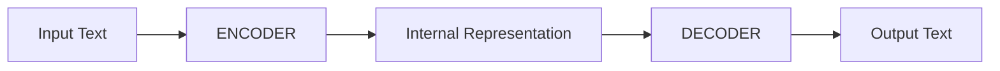
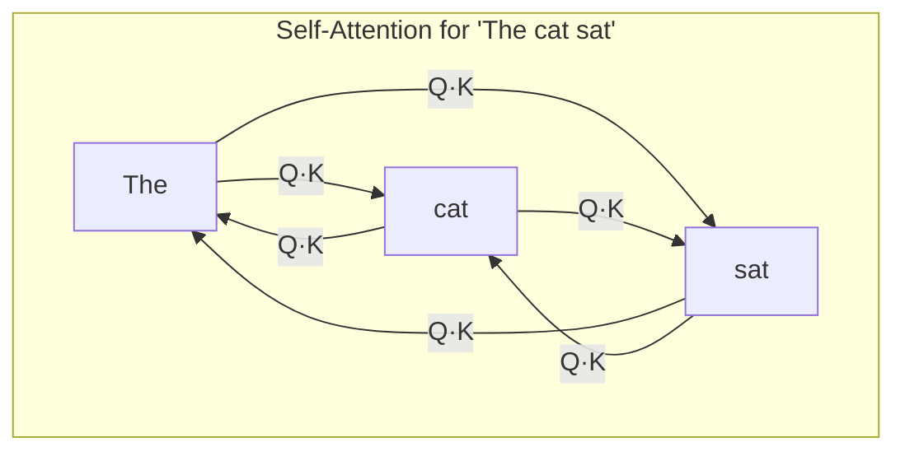

# What is a Transformer?

## Why the Name?

The 2017 Google paper was titled **"Attention Is All You Need"**. The architecture was called a "Transformer" because it **transforms** one sequence of representations into another through a mechanism called **self-attention** — where every token looks at every other token to decide what's important.

Before transformers, sequence processing was done with RNNs/LSTMs which read tokens **one at a time**, left to right, like reading a sentence word by word. The transformer's breakthrough was: process **all tokens simultaneously** using attention matrices. This was massively parallelizable on GPUs and captured long-range dependencies far better.

## The Original Architecture: Two Halves

The original transformer had two distinct components:

- **Encoder**: Reads the full input with **bidirectional** attention (every token sees every other token). Produces a rich understanding of the input.
- **Decoder**: Generates output tokens one at a time with **causal** attention (each token only sees previous tokens — can't peek ahead).

The original use case was **machine translation** (English → French). You encode the full English sentence, then decode it into French word by word.

## Why Did Encoder-Only Models Emerge?

Researchers realized: **not every task needs generation.** Many NLP tasks are about **understanding**, not producing text:

- Is this movie review positive or negative? (classification)
- Are these two sentences similar? (similarity)
- What entity does "he" refer to? (understanding)
- Find documents relevant to this query (retrieval)

For these tasks, you only need the **encoder** half — the part that reads the full input bidirectionally and produces a deep representation. The decoder (text generation) is unnecessary overhead.

So **BERT** (2018) threw away the decoder and trained just the encoder with two clever objectives:

1. **Masked Language Modeling**: Hide 15% of words, predict them from context ("The cat sat on the [MASK]" → "mat"). Forces bidirectional understanding.
2. **Next Sentence Prediction**: Do these two sentences follow each other? Forces inter-sentence understanding.

The result: a model that produces **rich vector representations** of text — perfect for classification, similarity, search, and embeddings.

## The Three Families

| Architecture | Sees | Good At | Examples |
|---|---|---|---|
| **Encoder-only** | All tokens (bidirectional) | Understanding, classification, embeddings | BERT, RoBERTa, BGE-M3 |
| **Decoder-only** | Past tokens only (causal) | Text generation | GPT, Llama, Shoonya |
| **Encoder-Decoder** | Both (encoder bidi, decoder causal) | Translation, summarization | T5, BART, original Transformer |

## Self-Attention: The Core Mechanism

The key innovation is **self-attention**. For each token in the sequence, the model computes:

1. **Query (Q)**: "What am I looking for?"
2. **Key (K)**: "What do I contain?"
3. **Value (V)**: "What information do I carry?"

The attention score between any two tokens is `Q · K^T / √d`, then softmax to get weights, then weighted sum of Values. This allows every token to attend to every other token in one step — no sequential processing.

In an **encoder** (bidirectional), all arrows exist — every token sees everything. In a **decoder** (causal), tokens can only attend to earlier tokens — the right-pointing arrows are masked out.

## Why This Matters for Shoonya

Shoonya is a **decoder-only** transformer, following the GPT/Llama lineage. It uses causal attention for text generation. But as we'll see in [Part V: Embeddings](./what_is_embedding.md), the 2024-2025 breakthrough was discovering that you can take a decoder-only model, **flip it to bidirectional** by removing the causal mask, and get state-of-the-art embeddings — because the LLM has far more knowledge from pretraining on trillions of tokens.

This is exactly the path we propose for building a Samyama-native embedding model from the Shoonya backbone.
