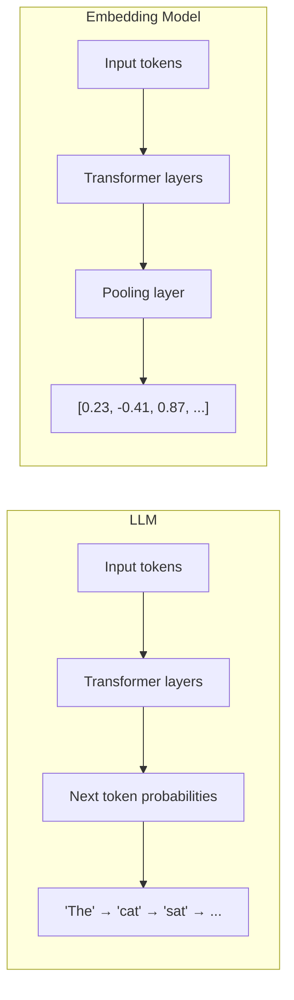

# What is an Embedding Model?

An embedding model is a **neural network** — but not necessarily a full LLM. It exists on a spectrum of complexity.

## The Spectrum

**Simplest form:** A plain neural network that maps inputs to fixed-size vectors. Word2Vec (2013) was just a shallow 2-layer network. No transformers at all.

**Middle ground:** Encoder-only transformers like BERT (2018), BGE-M3 (568M params). These are transformer-based but **not generative** — they can't produce text. They're trained specifically to output dense vectors that capture semantic meaning.

**Current SOTA:** Take an actual decoder-only LLM (Mistral-7B, Qwen3-8B, Llama-3.1-8B), **strip the generation head**, flip to bidirectional attention, add a pooling layer, and fine-tune it with contrastive loss. This is what NV-Embed-v2, Qwen3-Embedding, etc. do. So yes, these are literally LLMs repurposed as embedding models.

## LLM vs Embedding Model

The key difference is the **output**:

| | LLM | Embedding Model |
|---|---|---|
| **Output** | Next token (vocabulary-sized probability distribution) | Single fixed-size vector (e.g., 4096 floats) |
| **Use** | Generate text | Compare similarity between inputs |
| **Attention** | Causal (sees only past tokens) | Bidirectional (sees full input) |
| **Training** | Next-token prediction | Contrastive learning (similar pairs close, dissimilar far) |

## Why Bidirectional Attention Matters for Embeddings

Consider the word "bank":
- "I sat by the river **bank**" → nature, water, ground
- "I went to the **bank** to deposit money" → finance, institution

With **causal** attention (decoder-only), when processing "bank", the model only sees tokens before it. With **bidirectional** attention (encoder), it sees the entire sentence — including "river" or "deposit money" after "bank". This full context produces much richer, more accurate embeddings.

That's why encoder-only transformers (BERT-family) dominated embeddings for years. The 2024-2025 twist was: take a decoder-only LLM, **flip it to bidirectional** by removing the causal mask, and get even better embeddings because the LLM has far more world knowledge from pretraining on trillions of tokens.

## Pooling Strategies

A transformer produces one vector per token. To get a single embedding for the whole input, you need **pooling**:

| Strategy | How | Quality (2025 rankings) |
|---|---|---|
| **Latent Attention Pooling** | Learned query vectors attend to all token outputs | Best (NV-Embed-v2) |
| **Multi-Layer Trainable Pooling** | Aggregate across multiple transformer layers | Strong |
| **Mean Pooling** | Average all token vectors | Solid baseline |
| **Last-token / EOS Pooling** | Use only the final token's vector | Weakest |

## Training: Contrastive Learning

Embedding models are trained to make **similar inputs close** and **dissimilar inputs far** in vector space. The dominant approach:

**Multiple Negatives Ranking Loss (MNRL):**
- Take a batch of (query, positive_document) pairs
- All other documents in the batch become negatives
- Minimize distance to the positive, maximize distance to negatives
- Larger batches = more negatives = better training signal

The modern two-stage recipe:
1. **Stage 1**: Contrastive pre-training on ~50-150M synthetic pairs
2. **Stage 2**: Fine-tune on curated domain-specific data with hard negatives

## Matryoshka Representation Learning (MRL)

A 2022 innovation now adopted universally: train the embedding to be useful at **multiple truncation points**. A 4096-dim embedding can be truncated to 256-dim and still work well. This enables:

- **Fast approximate search** at 256 dims
- **Precision search** at full 4096 dims
- **Storage optimization** — choose dims per use case

## What This Means for Shoonya

Since Shoonya is a decoder-only transformer with MoE and Mamba blocks, converting it to an embedding model means:
1. Remove the generation head (the final vocabulary projection layer)
2. Remove the causal attention mask → bidirectional
3. Add latent attention pooling
4. Fine-tune with contrastive loss on domain-specific data
5. Train with MRL for flexible dimensionality

The result: an embedding model that inherits all of Shoonya's knowledge and architecture optimizations (FlashAttention, MoE, etc.) while producing state-of-the-art vector representations.
